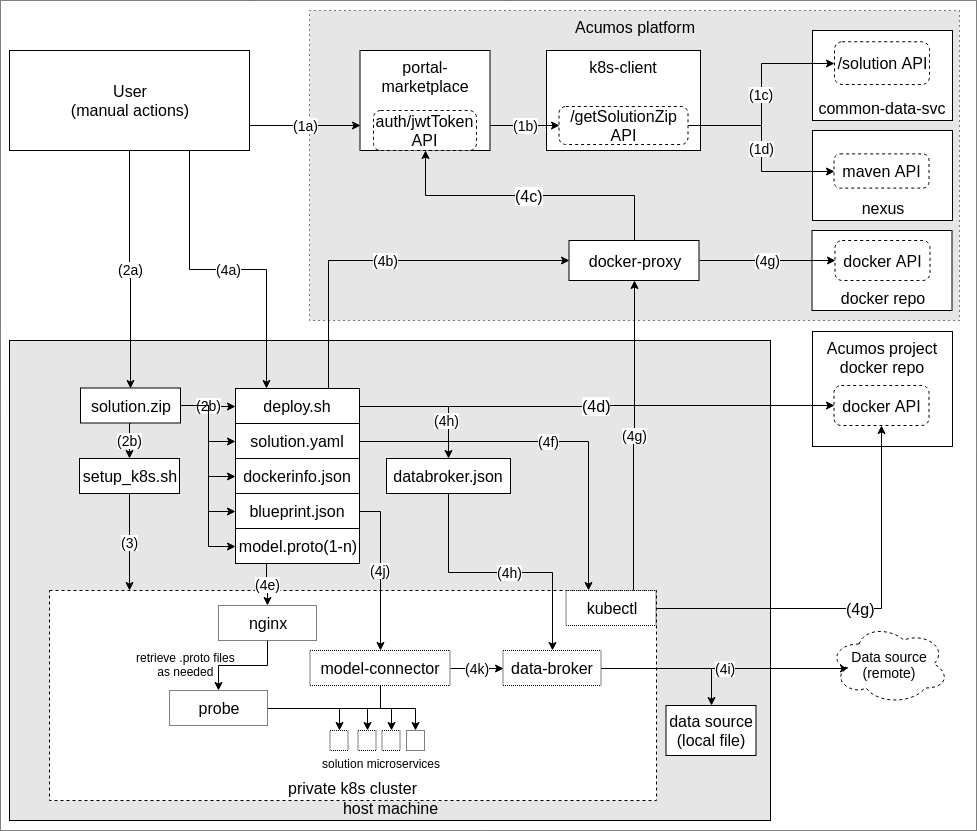
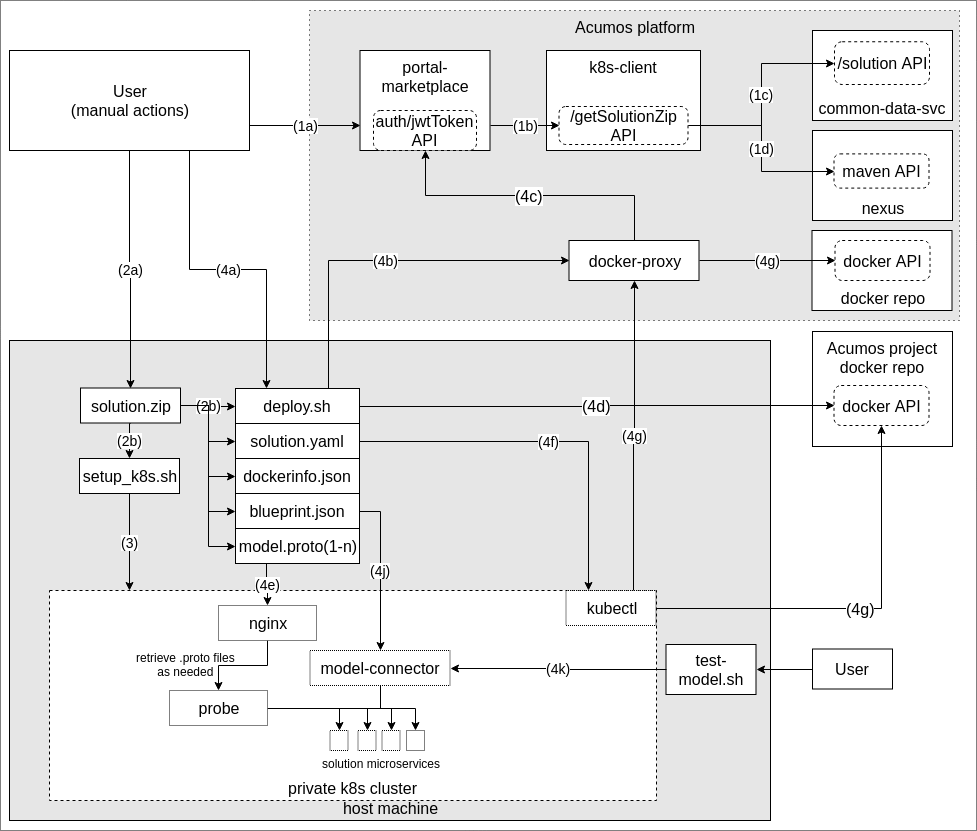

..
  ===============LICENSE_START=======================================================
  Acumos CC-BY-4.0
  ===================================================================================
  Copyright (C) 2018 AT&T Intellectual Property & Tech Mahindra. All rights reserved.
  ===================================================================================
  This Acumos documentation file is distributed by AT&T and Tech Mahindra
  under the Creative Commons Attribution 4.0 International License (the "License");
  you may not use this file except in compliance with the License.
  You may obtain a copy of the License at
..
  http://creativecommons.org/licenses/by/4.0
..
  This file is distributed on an "AS IS" BASIS,
  See the License for the specific language governing permissions and
  limitations under the License.
  ===============LICENSE_END=========================================================
..

========================================================
Acumos Solution Deployment in Private Kubernetes Cluster
========================================================

This document describes the design for the Acumos platform support of deploying
Acumos machine-learning models into private kubernetes (k8s) clusters, as simple
(single model) or composite (multi-model) solutions. This document is published
as part of the Acumos kubernetes-client repository. The private kubernetes
deployment capabilities and design are collectively referred to in this document
as the "private-k8s-deployment" feature.

-----
Scope
-----

"Private" as used here means a k8s cluster deployed in an environment (e.g.
VM(s) or bare metal machine(s)) for which the model user has ability to use the
kubectl CLI tool on the k8s cluster master ("k8s master") to manage apps in the
cluster. This is typically only available to users when they have deployed the
cluster for their own purposes, e.g. to develop/test k8s apps.

Other designs under the Acumos kubernetes-client repo will address deployment in
other k8s environments, e.g. public clouds, or using other more generic methods
that do not depend upon direct access to the k8s master node. There is expected
to be much in common across these designs, so this design is intended to provide
an initial baseline for direct reuse in other environments where possible.

Initially however, this design makes some simplifying assumptions/choices, which
over time can be relaxed or modified, to support other types of k8s environments
(e.g. other types of private and public k8s clusters, other host machines):

* deployment process split into two steps:

  * installation of a k8s cluster, as needed: a downloadable script is provided
    for this purpose, which the user must run prior to deploying the solution
  * user manual invocation of the deployment process on the k8s master, using a
    downloadable solution package including:

    * a kubernetes cluster setup script which the user can run to install a
      basic single- or mulit-node kubernetes cluster
    * a deployment script which the user can run to start the deployment in the
      installed or otherwise pre-existing kubernetes cluster
    * a k8s template for the solution (solution.yaml)
    * a model blueprint file and dockerinfo file as created by the Acumos Design
      Studio, and used by the Blueprint Orchestrator (referred to here and in
      solution.yaml files as the Model Connector) to route model messages through
      the set of model microservices
    * if the solution contains the "Proto Viewer" (referred to here and in
      solution.yaml files as the Probe), a set of folders containing the
      protobuf interface specification for each model microservice

* the k8s cluster is deployed (or will be) on a linux variant host OS. Ubuntu
  and Centos 7 will be specifically tested/supported.

............................
Previously Released Features
............................

This is the first release of private-k8s-deployment.

........................
Current Release Features
........................

The private-k8s-deployment features planned for delivery in the current release
("Athena") are:

* a utility script (k8s-cluster.sh) enabling the user to prepare a k8s cluster
  that includes the prerequisites of the solution deployment process
* a templated deployment shell script (deploy.sh) that executes the deployment
  when invoked by the user on the k8s master
* a new Acumos platform component, the "kubernetes-client", that collects solution
  artifacts, creates a k8s template for the solution, and prepares a
  downloadable solution package as "solution.zip"
* a new Acumos platform component, the "docker-proxy", which is installed as
  part of automated all-in-one (AIO) or manual installations, as described below

private-k8s-deployment depends upon these related features to be delivered in
the Athena release:

* Acumos portal-marketplace support for a new "deploy to local" option for a
  solution

* A new Acumos component, the "docker-proxy", which provides a user's kubernetes
  cluster to pull docker images from an Acumos platform Nexus repository

------------
Architecture
------------

The following diagram illustrates the functional components, interfaces, and
interaction of the components for a typical private-k8s-deployment process that
includes a composite solution, Data Broker, and Probe:

** Figure 1: Typical Deployment with all components deployed **

The following diagram illustrates the functional components, interfaces, and
interaction of the components for a typical private-k8s-deployment process that
includes a composite solution and Probe, but no Data Broker:

** Figure 2: Typical Deployment with all components except for Data Broker **

A summary of the process steps, with conditional statements illustrating where
the process varies depending upon the type of solution (simple or composite),
and inclusion of specific optional features (Data Broker, Probe):

#. At the Acumos platform, the user selects "deploy to local" (in the current
   release this is limited to a private kubernetes cluste).

   * A: the user selects the "Download Solution Package" button
   * B: the portal-marketplace calls the /getSolutionZip API of the k8s-client
     service
   * C: the k8s-client calls the Solution Controller APIs of the
     common-data-service to obtain the URIs of the artifacts to be included
   * D: the k8s-client calls the Maven artifact API of nexus to retrieve the
     artifacts, prepares the solution package, and returns it to the
     portal-marketplace, which downloads it to the user's machine

#. The user prepares the solution package for deployment

   * A: the user uploads the downloaded solution package to the k8s master host
   * B: the user unpacks the package, which includes

      * setup_k8s.sh: optional k8s cluster setup script
      * deploy.sh: deployment script
      * solution.yaml: k8s template for deploying the set of model microservices
        included in the solution, plus the Data Broker, Model Connector, and
        Probe services
      * blueprint.json: solution blueprint as created by the Design Studio
      * dockerinfo.json: file with microservice name to IP/Port mapping info
      * a "microservice" subfolder, containing a subfolder named for each
        model microservice container (by its container name) in the solution,
        within which is the "model.proto" artifact for the microservice

#. If needed, the user installs a k8s cluster by running the command, optionally
   specifying a set of hosts on which to deploy a multi-node kubernetes cluster

.. code-block:: bash

  bash setup_k8s.sh
..

#. The user kicks off the deployment, which runs automatically from this point

   * A: the user invokes deploy.sh, including parameters

     * the path to folder where solution.zip was unpacked; in the
       example below the user is in the folder where solution.zip was unpacked,
       thus the solution.yaml is in location "."
     * credentials as needed to authorize the user's docker client to pull
       solution microservice images during deployment

       * NOTE: for the Athena release, a single set of credentials are provided
         for all platform users. The next release will leverage the specific
         user's credentials on the Acumos platform.

     * if the Acumos Generic Data Broker was included in the solution, the data
       source (file or URL) that the Data Broker should use

.. code-block:: bash

  bash deploy.sh . 73f7fc0f-7a89-4ae9-a05d-5eb395d8b565 dc91194c-919a-4b47-b73b-e372c51ddff6
..

   * B: deploy.sh logs into the Acumos docker registry via the docker-proxy
     using the provided credentials
   * C: the docker-proxy validates the docker login credentials provided by the
        user, and confirms login success to the docker client

     * NOTE: the next release will leverage the specific user's credentials on
       the Acumos platform, as the docker-proxy will call the /api/auth/jwtToken
       API of the portal-marketplace to verify that the user is registered on
       the platform, and only then confirm login success to the docker client.

   * D: deploy.sh logs into the Acumos project docker registry, using the
     Acumos project credentials
   * E: if the solution includes the Model Connector (i.e. is a composite
     solution), deploy.sh copies the microservice folder to /var/acumos and
     updates the blueprint.json with the location of the model.proto files as
     they will be deployed by the embedded nginx server.
   * F: deploy.sh initiates deployment of the solution via kubectl, using the
     solution.yaml template. kubectl deploys all the services defined in the
     template.
   * G: using the cached authentication for the Acumos docker registry (via
     the docker-proxy, which validates the active login of the user, and pulls
     the requested image(s) from the Acumos platform docker registry) and
     the Acumos project docker registry, k8s pulls the docker images for all
     solution microservices and Acumos project components, and deploys them.
   * H: if the solution includes the Data Broker, when the Data Broker service
     is active (determined by monitoring its status through kubectl), deploy.sh

     * extracts the "data_broker_map" section of blueprint.json as databroker.json
     * invokes the Data Broker /configDB API to configure Data Broker with model
       data source to target mapping info using databroker.json

   * I: if the solution includes the Data Broker, the Data Broker begins
     retrieving the solution input data, and waits for a /pullData API request
     from the Model Connector
   * J: When all of the microservices are active (determined by monitoring their
     status through kubectl), if the solution includes the Model Connector,
     deploy.sh

     * invokes the Model Connector /putDockerInfo API with dockerinfo.json
     * invokes the Model Connector /putBlueprint API with blueprint.json

   * K: if the solution includes the Data Broker, the Model Connector calls the
     Data Broker /pullData API to start retrieval of test/training data.
     Otherwise, as shown in "Figure 2" above, the user will start sending data
     directly to the Model Connector, possibly using tools such as the
     test-model.sh script provided in the kubernetes-client repo.

     * test-model.sh is intended to simplify interaction with models that take
       input data in CSV form. Additional types of input (e.g. images) will be
       supported in future releases.

Solution operation proceeds, with data being routed into the model microservice(s)
by the following, as applicable to the solution:

* by the Data Broker, upon request of the Model Connector
* if Data Broker is not included, by the Model Connector upon reception of
  a protobuf message matching the first blueprint node's input operation
* if neither the Data Broker or Model Connector are included, upon reception
  a protobuf message matching the model's input operation

.....................
Functional Components
.....................

The private-k8s-deployment feature will depend upon two new Acumos component
microservices:

* kubernetes-client: packages solution artifacts and deployment tools into the
  "solution.zip" package
* docker-proxy: provides an authentication proxy for the platform docker repo

Other Acumos component dependencies, with related impacts in this release:

* portal-marketplace: provides the user with a download link to the
  "setup_k8s.sh" script, and a "deploy to local" dialog that allows
  the user to download the solution.zip package

Other Acumos component dependencies, used as-is:

* common-data-svc: provides information about solution artifacts to be retrieved
* nexus: provides access to the maven artifact repository
* docker repository: as provided by the Acumos nexus service or another docker
  repository service, provides access to the microservice docker images as
  they are deployed by the k8s cluster

Other dependencies:

* a kubernetes cluster, deployed via the "setup_k8s.sh" script, or otherwise

..........
Interfaces
..........

************
Exposed APIs
************

+++++++++++++++++
Solution Download
+++++++++++++++++

The k8s-client service exposes the following API for the portal-marketplace to
obtain a downloadable package of solution artifacts and deployment script,
for a specific solution revision.

The base URL for this API is: http://<k8s-client-service-host>:<port>, where
'k8s-client-service-host' is the routable address of the verification service
in the Acumos platform deployment, and port is the assigned port where the
service is listening for API requests.

* URL resource: /getSolutionZip/{solutionId}/{revisionId}

  * {solutionId}: ID of a solution present in the CDS 
  * {revisionId}: ID of a version for a solution present in the CDS 

* Supported HTTP operations

  * GET

    * Response

      * 200 OK

        * meaning: request successful
        * body: solution package (solution.zip)

      * 404 NOT FOUND

        * meaning: solution/revision not found, details in JSON body. NOTE: this
          response is only expected in race conditions, e.g. in which a deploy
          request was initiated when at the same time, the solution was deleted
          by another user
        * body: JSON object as below

          * status: "invalid solutionId"|"invalid revisionId"

++++++++++++
Docker Login
++++++++++++

The Acumos platform docker-proxy will expose the docker login API.

+++++++++++
Docker Pull
+++++++++++

The Acumos platform docker-proxy will expose the docker pull API.

*************
Consumed APIs
*************

++++++++++++
Docker Login
++++++++++++

Via the local docker CLI client on the host machine, deploy.sh will call the
login API of:

* the Acumos platform docker-proxy, to verify that the user is authorized to
  access docker images in the Acumos platform docker registry
* the Acumos project Nexus docker API, to enable pull of the Acumos project
  docker images to be deployed as part of the solution

+++++++++++
Docker Pull
+++++++++++

Via the local docker CLI client on the host machine, kubectl will call the
docker pull API of:

* the Acumos platform docker-proxy, to pull the model microservice images to be
  deployed as part of the solution
* the Acumos project Nexus docker API, to pull the Acumos project docker images
  to be deployed as part of the solution

++++++++++++++++++++++++++
Portal User Authentication
++++++++++++++++++++++++++

NOTE: the next release will leverage the specific user's credentials on the
Acumos platform, as the docker-proxy will call the /api/auth/jwtToken API of
the portal-marketplace to verify that the user is registered on the platform,
and only then confirm login success to the docker client.

+++++++++++++++++++
Solution Controller
+++++++++++++++++++

The k8s-client service will call the Solution Controller APIs of the
common-data-svc to obtain the following solution/revision-related data:

* nexus URI of the model.proto artifact
* nexus URI of the blueprint.json artifact (if any)

----------------
Component Design
----------------

..........
k8s-client
..........

Upon a request to the /getSolutionZip API, the k8s-client will perform the
following high-level actions to prepare the downloadable solution deployment
package:

* get the following artifacts if existing from Nexus, by querying the CDS for
  the set of solution/revision artifacts

  * blueprint.json
  * databroker.json

* if a blueprint.json artifact was found, this is a composite solution and the
  following actions are taken

  * get the model.proto artifact for each solution model microservice, for the
    model revision included in the solution
  * create a kubernetes service+deployment template as solution.yaml including
    all the solution components included in blueprint.json. See below for an
    example.
  * For a solution that does not include the Data Broker, the Model Connector
    service will be assigned a "type: NodePort" port with nodePort value of
    30855, so that data can be directly pushed to the solution
  * create a dockerinfo.json file using the example below

* if a blueprint.json artifact was not found, this is a simple solution and a
  kubernetes service+deployment template is created, as solution.yaml. See below
  for an example.
* In the generated solution.yaml, specify for each model microservice the
  hostname:port for the Acumos platform docker proxy, e.g.
  "acumos.example.com:35001" in the examples below
* retrieve the current deploy.sh script from the Acumos github mirror, at
  https://raw.githubusercontent.com/acumos/kubernetes-client/master/deploy/private/deploy.sh
* retrieve the current setup_k8s.sh script from the Acumos github mirror, at
  https://raw.githubusercontent.com/acumos/kubernetes-client/master/deploy/private/setup_k8s.sh
* create a zip archive as solution.zip containing:

  * deploy.sh
  * solution.yaml
  * for a composite solution:

    * blueprint.json
    * dockerinfo.json
    * databroker.json (if Data Broker is included in the solution)
    * a "microservice" subfolder, with subfolders named for each model
      microservice, containing the model.proto for that model (if Probe is
      included in the solution)

* return the solution.zip as /getSolutionZip API response

Design notes for the solution.yaml structure:

* to support distribution of solution microservices and other Acumos components
  (Data Broker, Model Connector, Probe) across nodes in multi-node kubernetes
  clusters, each microservice and the Acumos components are deployed using
  a specific service and related deployment spec.
* services which require external exposure on the cluster are provided nodePort
  assignments. These include:

  * simple solution microservices, to expose its protobuf API
  * for composite solutions, as applies to the specific solution design

    * Data Broker (if included, for its API)
    * Model Connector (for receiving pushed model data, when Data Broker is N/A)
    * any model microservices that require external exposure for receiving data
    * Probe (for its UI)

Following are a series of examples of solution.yaml templates, from simple to
complex. The first is an example of the generated solution.yaml template for a
simple solution. Notes on the template attributes:

* the model microservice is directly exposed at NodePort 30333, in the default
  range for kubernetes nodePorts
* the cluster-internal port value 8557 is selected per the Acumos convention
  of assigning model microservices ports starting at 8557
* the model pod created by the deployment is exposed at port 3330, which is the
  Acumos convention for microservices as built by the microservice-generation
  component of the Acumos platform
* the namespace "acumos" ensures that the ports assigned to the microservice
  does not conflict with other pods on the kubernetes cluster
* the imagePullSecrets value "acumos-registry" refers to the cached credentials
  for the user for access to the Acumos platform docker registry
* so that the model microservice images and Data Broker image (in a later
  example) can be pulled from the Acumos platform repository, the host and port
  (default 30883) in the image name are set to values for the docker-proxy, as
  specified in the environment section of the kubernetes-client template

.. code-block:: yaml

  apiVersion: v1
  kind: Service
  metadata:
    namespace: acumos
    name: padd
  spec:
    selector:
      app: padd
    type: NodePort
    ports:
    - name: protobuf-api
      nodePort: 30333
      port: 8557
      targetPort: 3330
  ---
  apiVersion: apps/v1
  kind: Deployment
  metadata:
    namespace: acumos
    name: padd
    labels:
      app: padd
  spec:
    replicas: 1
    selector:
      matchLabels:
        app: padd
    template:
      metadata:
        labels:
          app: padd
      spec:
        imagePullSecrets:
        - name: acumos-registry
        containers:
        - name: padd
          image: acumos.example.com:30883/padd_cee0c147-3c64-48cd-93ae-cdb715a5420c:3
          ports:
          - name: protobuf-api
            containerPort: 3330
..

Example of the generated solution.yaml template for a complex (composite)
solution with two model microservices and Model Connector. Notes on the template
attributes:

* the model microservices are accessed via the Model Connector, which is directly
  exposed at NodePort 30555, and internal to the cluster namespace at port 8555,
  as specified in the Acumos project build process for the Data Broker image
* the names given to the services defined for each model microservice serve as
  resolvable hostnames within the cluster namespace, so their protobuf-api
  interfaces can be accessed by other pods in the cluster e.g. Model Connector,
  independent of the assigned service IP
* the image name (repository and image version) for the Model Connector is set
  by an environment parameter in the kubernetes-client template

.. code-block:: yaml

  apiVersion: v1
  kind: Service
  metadata:
    namespace: acumos
    name: modelconnector
  spec:
    selector:
      app: modelconnector
    type: NodePort
    ports:
    - name: mc-api
      nodePort: 30555
      port: 8555
      targetPort: 8555
  ---
  apiVersion: apps/v1
  kind: Deployment
  metadata:
    namespace: acumos
    name: modelconnector
    labels:
      app: modelconnector
  spec:
    replicas: 1
    selector:
      matchLabels:
        app: modelconnector
    template:
      metadata:
        labels:
          app: modelconnector
      spec:
        imagePullSecrets:
        - name: acumos-registry
        containers:
        - name: modelconnector
          image: nexus3.acumos.org:10004/blueprint-orchestrator:1.0.13
          ports:
          - name: mc-api
            containerPort: 8555
          volumeMounts:
          - mountPath: /logs
            name: logs
        restartPolicy: Always
        volumes:
        - name: logs
          hostPath:
            path: /var/acumos/log
  ---
  apiVersion: v1
  kind: Service
  metadata:
    namespace: acumos
    name: padd1
  spec:
    selector:
      app: padd1
    type: ClusterIP
    ports:
    - name: protobuf-api
      port: 8557
      targetPort: 3330
  ---
  apiVersion: apps/v1
  kind: Deployment
  metadata:
    namespace: acumos
    name: padd1
    labels:
      app: padd1
  spec:
    replicas: 1
    selector:
      matchLabels:
        app: padd1
    template:
      metadata:
        labels:
          app: padd1
      spec:
        imagePullSecrets:
        - name: acumos-registry
        containers:
        - name: padd1
          image: acumos.example.com:30883/padd_cee0c147-3c64-48cd-93ae-cdb715a5420c:3
          ports:
          - name: protobuf-api
            containerPort: 3330
  ---
  apiVersion: v1
  kind: Service
  metadata:
    namespace: acumos
    name: square1
  spec:
    selector:
      app: square1
    type: ClusterIP
    ports:
    - name: protobuf-api
      port: 8558
      targetPort: 3330
  ---
  apiVersion: apps/v1
  kind: Deployment
  metadata:
    namespace: acumos
    name: square1
    labels:
      app: square1
  spec:
    replicas: 1
    selector:
      matchLabels:
        app: square1
    template:
      metadata:
        labels:
          app: square1
      spec:
        imagePullSecrets:
        - name: acumos-registry
        containers:
        - name: square1
          image: acumos.example.com:30883/square_c8797158-3ead-48fd-ab3e-6b429b033677:6
          ports:
          - name: protobuf-api
            containerPort: 3330
..

Example of the generated solution.yaml template for a complex (composite)
solution with two model microservices, Data Broker, Model Connector, and Probe.
Notes on the template attributes:

* the model microservices are accessed via the Data Broker, which is exernally
  exposed at NodePort 30555
* the Data Broker, Model Connector, and Probe are exposed internal to the cluster
  at the ports specified in the Acumos project build processes for those images
* the Model Connector is also externally exposed at NodePort 30555 so that it can
  be configured by deploy.sh via its APIs
* the Probe is also exposed externally at NodePort 30800 so that its UI can be
  access by the user's web browser
* the image name (repository and image version) for the Probe is set by an
  environment parameter in the kubernetes-client template
* the Data Broker image name is set per the "datasource" type model that the user
  selected in creating the composite solution

.. code-block:: yaml

  apiVersion: v1
  kind: Service
  metadata:
    namespace: acumos
    name: databroker
  spec:
    selector:
      app: databroker
    type: NodePort
    ports:
    - name: databroker-api
      nodePort: 30556
      port: 8556
      targetPort: 8556
  ---
  apiVersion: apps/v1
  kind: Deployment
  metadata:
    namespace: acumos
    name: databroker
    labels:
      app: databroker
  spec:
    replicas: 1
    selector:
      matchLabels:
        app: databroker
    template:
      metadata:
        labels:
          app: databroker
      spec:
        imagePullSecrets:
        - name: acumos-registry
        containers:
        - name: databroker
          image: acumos.example.com:30883/genericdatabroker:1
          ports:
          - containerPort: 8556
          volumeMounts:
          - mountPath: /var/acumos/datasource
            name: datasource
        restartPolicy: Always
        volumes:
        - name: datasource
          hostPath:
            path: /var/acumos/datasource
  ---
  apiVersion: v1
  kind: Service
  metadata:
    namespace: acumos
    name: probe
  spec:
    selector:
      app: probe
    type: NodePort
    ports:
    - nodePort: 30800
      port: 5006
      targetPort: 5006
  ---
  apiVersion: apps/v1
  kind: Deployment
  metadata:
    namespace: acumos
    name: probe
    labels:
      app: probe
  spec:
    replicas: 1
    selector:
      matchLabels:
        app: probe
    template:
      metadata:
        labels:
          app: probe
      spec:
        imagePullSecrets:
        - name: acumos-registry
        containers:
        - name: probe
          image: nexus3.acumos.org:10004/acumos-proto-viewer:1.5.5
          env:
          - name: NEXUSENDPOINTURL
            value: http://localhost:80
          - name: ACUMOS_PROBE_EXTERNAL_PORT
            value: "30800"
          ports:
          - name: probe-api
            containerPort: 5006
        - name: nginx
          image: nginx
          ports:
          - name: probe-schema
            containerPort: 80
          volumeMounts:
          - mountPath: /usr/share/nginx/html
            name: proto-files
        restartPolicy: Always
        volumes:
        - name: proto-files
          hostPath:
            path: /var/acumos/microservice
  ---
  apiVersion: v1
  kind: Service
  metadata:
    namespace: acumos
    name: modelconnector
  spec:
    selector:
      app: modelconnector
    type: NodePort
    ports:
    - name: mc-api
      nodePort: 30555
      port: 8555
      targetPort: 8555
  ---
  apiVersion: apps/v1
  kind: Deployment
  metadata:
    namespace: acumos
    name: modelconnector
    labels:
      app: modelconnector
  spec:
    replicas: 1
    selector:
      matchLabels:
        app: modelconnector
    template:
      metadata:
        labels:
          app: modelconnector
      spec:
        imagePullSecrets:
        - name: acumos-registry
        containers:
        - name: modelconnector
          image: nexus3.acumos.org:10004/blueprint-orchestrator:1.0.13
          ports:
          - name: mc-api
            containerPort: 8555
          volumeMounts:
          - mountPath: /logs
            name: logs
        restartPolicy: Always
        volumes:
        - name: logs
          hostPath:
            path: /var/acumos/log
  ---
  apiVersion: v1
  kind: Service
  metadata:
    namespace: acumos
    name: padd1
  spec:
    selector:
      app: padd1
    type: ClusterIP
    ports:
    - name: protobuf-api
      port: 8557
      targetPort: 3330
  ---
  apiVersion: apps/v1
  kind: Deployment
  metadata:
    namespace: acumos
    name: padd1
    labels:
      app: padd1
  spec:
    replicas: 1
    selector:
      matchLabels:
        app: padd1
    template:
      metadata:
        labels:
          app: padd1
      spec:
        imagePullSecrets:
        - name: acumos-registry
        containers:
        - name: padd1
          image: acumos.example.com:30883/padd_cee0c147-3c64-48cd-93ae-cdb715a5420c:3
          ports:
          - name: protobuf-api
            containerPort: 3330
  ---
  apiVersion: v1
  kind: Service
  metadata:
    namespace: acumos
    name: square1
  spec:
    selector:
      app: square1
    type: ClusterIP
    ports:
    - name: protobuf-api
      port: 8558
      targetPort: 3330
  ---
  apiVersion: apps/v1
  kind: Deployment
  metadata:
    namespace: acumos
    name: square1
    labels:
      app: square1
  spec:
    replicas: 1
    selector:
      matchLabels:
        app: square1
    template:
      metadata:
        labels:
          app: square1
      spec:
        imagePullSecrets:
        - name: acumos-registry
        containers:
        - name: square1
          image: acumos.example.com:30883/square_c8797158-3ead-48fd-ab3e-6b429b033677:6
          ports:
          - name: protobuf-api
            containerPort: 3330
..

The included dockerinfo.json can be created directly by the kubernetes-client
as both the container name and the cluster-internal address (resolvable
cluster-internal hostname, and port) of each container can be pre-determined
per the assignments in solution.yaml as above. Example of dockerinfo.json for
the composite solution above:

.. code-block:: json

  {
    "docker_info_list": [
      {
        "container_name": "databroker",
        "ip_address": "databroker",
        "port": "8556"
      },
      {
        "container_name": "modelconnector",
        "ip_address": "modelconnector",
        "port": "8555"
      },
      {
        "container_name": "probe",
        "ip_address": "probe",
        "port": "5006"
      },
      {
        "container_name": "padd1",
        "ip_address": "padd1",
        "port": "8557"
      },
      {
        "container_name": "square1",
        "ip_address": "square1",
        "port": "8558"
      }
    ]
  }
..

............
docker-proxy
............

The docker-proxy service of the Acumos platform will provide a simple
user-authenticating frontend (reverse proxy) for the docker registry configured
as part of the Acumos platform. The docker-proxy service as of the Athena
release is based upon nginx as described at
https://docs.docker.com/v17.09/registry/recipes/nginx/. The nginx server is
installed under docker-CE using docker-compose, as described under
`Operations User Guide`_. The docker-proxy service terminates secure connections
(HTTPS) as a proxy for docker operations, connecting to the platform docker
registry on the backend through an HTTP connection.

The docker-proxy will provide only a docker login service and image download
service for docker pull requests, as below:

* validate the username and password provided in docker login requests

  * NOTE: as of Athena release, the following user-specific design aspects are
    deferred to the Boreas release, and a single username/password is supported
    by the docker-proxy service. See `Operations User Guide`_ for details.

    * upon a docker login request, invoke the auth/jwtToken API of the Acumos
      portal, with the username and password provided in the docker login request
    * if the auth/jwtToken API returns success, accept the user login and return
      an authentication token for the user, otherwise return an authentication error

* upon a docker pull request, if there is a valid authentication token, attempt
  to retrieve the requested image from the Acumos platform docker registry, and
  return the result to the requester

To support the use of self-signed certificates for the docker-proxy, deploy.sh
will configure docker on the kubernetes master to support the specified
docker proxy as an insecure registry, i.e. one in which a self-signed
certificate will be accepted, if provided.

..............
setup_k8s.sh
..............

setup_k8s.sh is a tool allowing the user to install a basic single-or-multinode
kubernetes cluster. It will install kubernetes prerequisites and core services
via the following actions:

* install the latest docker-ce version
* install the latest stable kubernetes version (currently 1.10.0)
* initialize the kubernetes master node
* install calico as CNI
* setup kubernetes worker nodes if the user selected more than one target node

As future needs arise, the kubernetes cluster setup will be extended with
helm as deployment tool, and persistent volume support via ceph.

.........
deploy.sh
.........

After the user has transferred solution.zip to the deployment host and unzipped
it, deploy.sh will be invoked by the user from a shell session on the deployment
host, using the example command:

.. code-block:: shell

  bash deploy.sh <docker-proxy username> <docker-proxy password> <datasource>

where:

* docker-proxy username> is the user's account username on the Acumos platform

  * NOTE: for the Athena release, this must be a single value set for the
    platform in the installation of the docker-proxy, as described under
    `Operations User Guide`_

* <docker-proxy password> is the user's account password on the Acumos platform

  * NOTE: for the Athena release, this must be a single value set for the
    platform in the installation of the docker-proxy, as described under
    `Operations User Guide`_

* <datasource> is where the Data Broker will be instructed to obtain data to
  feed into the solution, and can be a file path or a URL

deploy.sh will then take the following actions to deploy the solution:

* retrieve the hostname:port of the Acumos platform docker proxy from the
  solution.yaml, using the "image" attribute of any model microservice
* if not already configured, configure the docker service to allow access to the
  Acumos platform docker proxy as an insecure registry.
* login to the Acumos platform docker proxy using the docker-proxy username
  and password provided by the user
* login to the Acumos project docker registry (current credentials are provided
  as default values in deploy.sh)
* copy the subfolders under "microservice" from the unpacked solution.zip to
  /var/acumos
* update Data Broker.json per the datasource selected by the user

  * if the user provided a file path as datasource, replace the hostpath
    attribute of the Data Broker deployment in solution.yaml with the
    user-provided file path, replace the "local_system_data_file_path" attribute
    in Data Broker.json with the path "/var/acumos/datasource", and set the
    "target_system_url" attribute to ""
  * if the user provided a URL as datasource, set the "target_system_url"
    attribute in Data Broker.json to the URL, and set the
    "local_system_data_file_path" attribute to ""

* create a namespace "acumos" using kubectl
* create a secret "acumos-registry" using ~/.docker/config.json
* invoke kubectl to deploy the services and deployments in solution.yaml
* monitor the status of the Data Broker service and deployment, and when they are
  running, send Data Broker.json to the Data Broker via its /configDB API
* monitor the status of all other services and deployments, and when they are
  running

  * create dockerinfo.json with the service name, assigned IP address, and
    port of each service defined in solution.yaml
  * send dockerinfo.json to the Model Connector service via the /putDockerInfo
    API
  * send blueprint.json to the Model Connector service via the /putBlueprint API

---------------------
Operations User Guide
---------------------

Platform support for private-k8s-deployment is automatically installed as part
of the :doc:`Acumos AIO (all-in-one) <../../../AcumosUser/oneclick-deploy/user-guide>`
deployment process. For manual installations, the docker-proxy component needs
to be manually installed using the "deploy.sh" script from the Acumos
system-integration repo. The subsections below address how to deploy the
docker-proxy for Acumos platforms installed using other methods (e.g. manually),
and how to maintain the docker-proxy service in the platform.

NOTE: for the Athena release, only a single docker-proxy user account is
supported, as a value that the Acumos platform admin can set/change as needed.
The Boreas release will support authentication of users using their Acumos
platform credentials. As a result of this design limitation,the current
platform support for the docker-proxy is intended for use in private Acumos
installations.

However, since Acumos platforms installed for company use typically are viewed
as private to that company, this limitation should not impact the usefullness
of the current release support for deployment in kubernetes. Further, admins
can change the docker-proxy credentials at any time, through a process described
below under `Updating the docker-proxy credentials`_.

................................
Manual docker-proxy Installation
................................

The docker-proxy service can be manually installed by following these steps:

* clone the Acumos system-integration repo onto one of the host machines in your
  Acumos platform cluster, and enter the folder

.. code-block:: shell

  git clone https://gerrit.acumos.org/r/system-integration
  cd system-integration
..

* edit acumos-env.sh in that folder

  * set ACUMOS_NEXUS_HOST to the hostname or IP address of your Nexus server or
    other docker registry used by your Acumos platform
  * set ACUMOS_DOCKER_MODEL_PORT the port where the docker registry for your
    platform is accessible

    * NOTE: the platform docker registry must be exposed at the specified host
      and port as a non-secure (http-based) service, and accessible to the host
      where you are installing the docker-proxy

  * set ACUMOS_RO_USER to the username of the Nexus server "RO" (read-only)
    account setup for your platform
  * if needed, choose a different value for ACUMOS_DOCKER_PROXY_PORT

  * add these lines to the end of the script, choosing values as desired

    * ACUMOS_RO_USER_PASSWORD="Nexus RO user password for your installation"
    * export ACUMOS_RO_USER_PASSWORD
    * ACUMOS_DOCKER_PROXY_USERNAME="username"
    * export ACUMOS_DOCKER_PROXY_USERNAME
    * ACUMOS_DOCKER_PROXY_PASSWORD="password"
    * export ACUMOS_DOCKER_PROXY_PASSWORD

* Copy your Acumos platform server certificate and key to the following
  locations

  * Certificate:     /var/acumos/docker-proxy/auth/domain.crt
  * Certificate key: /var/acumos/docker-proxy/auth/domain.key

* run deploy.sh

.. code-block:: shell

  bash docker-proxy/deploy.sh
..

Once deploy.sh completes, the docker-proxy should be ready to proxy docker
login requests to the platform Nexus server. To test this, run the command:

.. code-block:: shell

  sudo docker login <ACUMOS_DOMAIN>:<ACUMOS_DOCKER_PROXY_PORT> -u <ACUMOS_DOCKER_PROXY_USERNAME> -p <ACUMOS_DOCKER_PROXY_PASSWORD>
..

where:

* ACUMOS_DOMAIN is the domain name or IP address of your Acumos platform, and is
  setup for use with your server certificate
* ACUMOS_DOCKER_PROXY_PORT, ACUMOS_DOCKER_PROXY_USERNAME, and
  ACUMOS_DOCKER_PROXY_PASSWORD are as defined in acumos-env.sh (updated as
  needed, per the instructions above)

.....................................
Updating the docker-proxy credentials
.....................................

To update the docker-proxy credentials, edit acumos-env.sh and select new
values for:

* ACUMOS_DOCKER_PROXY_USERNAME
* ACUMOS_DOCKER_PROXY_PASSWORD

The redeploy the docker-proxy service, delete and restart it via:

.. code-block:: shell

  sudo bash docker-proxy/docker-compose.sh -f docker-compose.yml down -v
  bash docker-proxy/deploy.sh
..

..............................
Testing private-k8s-deployment
..............................

To test operation of the private-k8s-deployment, follow these steps:

* create or select a composite solution to deploy
* when viewing the solution, select the "deploy to local" option as described above
* save the downloaded solution.zip to your host where you will deploy it
* unzip the solution.zip file
* if you don't have a private k8s cluster (for which you have admin rights on the
  k8s master node), install a private cluster

.. code-block:: shell

  bash setup_k8s.sh
..

* when the k8s cluster has been installed, deploy the solution

.. code-block:: shell

 bash deploy.sh . <ACUMOS_DOCKER_PROXY_USERNAME> <ACUMOS_DOCKER_PROXY_PASSWORD>
..

To test that the solution works as expected, use the applicable test harness
as specified for the solution. For example, to verify a simple CSV-based model
which adds two values, and squares the result, you can use the
"`test-model.sh <https://github.com/acumos/kubernetes-client/blob/master/deploy/private/test-model.sh>`_"
script from the Acumos kubernetes-client repo. An example is shown below. In
the output of that script, the "+" lines show how the script communicates with
the model using the protobuf interface, and the "d: 36" shows the output is
calculated correctly. This verifies that the model was deployed correctly, and
the Model Connector is able to route the protobuf messages through the sequence
of model microservices.

.. code-block:: shell

  bash test-model.sh "f1:2.0,f2:4.0" acumos
  + echo f1:2.0,f2:4.0
  + /home/ubuntu/protoc/bin/protoc --encode=qpkoABdpWtEectZiyCoOSVwwmOyrVLcv.ParmInput --proto_path=microservice/padd1 microservice/padd1/model.proto
  + curl -s --request POST --header 'Content-Type: application/protobuf' --data-binary @- http://acumos:30555/padd
  + /home/ubuntu/protoc/bin/protoc --decode rJdqDZiRsZmWwHvgVFBWtGwvPgvuIHEM.SquareMessage --proto_path=microservice/square1 microservice/square1/model.proto
  d: 36
  + set +x
..

To terminate a solution deployment, run:

.. code-block:: shell

  kubectl delete -f solution.yaml
..

You can then redeploy the solution as described above.
